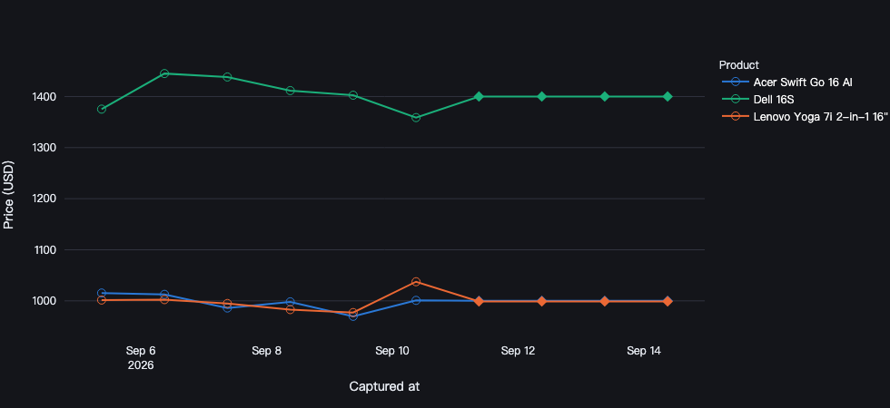

# AI-Powered PC Pricing Tracker

Application assessment for the Lenovo AI Application Development Intern position (WD00102927).



## Quick start

Requires Python 3.12 (any recent Python 3.10+ should also work).

```bash
pip install -r requirements.txt
cp .env.example .env   # optional — add a free Gemini API key to enable the AI chat panel
streamlit run app.py
```

That's it — `data/price_snapshots.csv` already has real price history in it, so the tracker works right away. Note it's a Streamlit app, so it must be launched with `streamlit run app.py`, not `python app.py`.

**Optional, not required to view the tracker:**
- `python fetch_prices.py` pulls one fresh live price per product (requires Google Chrome — it drives a real, visible browser window via Selenium).
- `python seed_history.py` regenerates the simulated bootstrap history.

> If `pip install` fails trying to build `pyarrow` from source, your Python isn't
> a standard native build for this OS/architecture (this happened on this dev
> machine's Rosetta-emulated Python on Apple Silicon). Easiest fix: install a
> native Python 3.10+, or use [uv](https://docs.astral.sh/uv/) instead —
> `uv venv --python 3.12 .venv && uv pip install --python .venv/bin/python -r requirements.txt`,
> then run the app with `.venv/bin/streamlit run app.py`.

## Changing the tracked products

Edit `data/products.csv` — this is the static product catalog, maintained by hand; the schedule / `fetch_prices.py` only reads it, never writes to it. Columns: `group_id, group_name, retailer, description, os, form_factor, processor, ram_gb, storage_gb, url, sku, display_name`. `url` is the Best Buy product page link; `sku` is the number after `/sku/` in that URL (if left blank, the script parses it out automatically with a regex).

## Automating price snapshots (scheduling)

To collect prices automatically instead of running `fetch_prices.py` by hand:

1. Make the wrapper executable once: `chmod +x run_snapshot.sh`
2. Add a crontab entry with `crontab -e` (1-2 times a day is enough — more increases the chance of tripping Best Buy's rate limit):
   ```
   0 9,21 * * * /absolute/path/to/lenovo/run_snapshot.sh
   ```
   Use the actual absolute path to this project folder.
3. Each run appends one row per product to `data/price_snapshots.csv` and writes its output to `logs/snapshot.log` (created automatically).

`run_snapshot.sh` activates `.venv` itself if one exists at this path, otherwise it just uses whatever `python3` is on the system — no extra setup needed beyond step 1.

Since the scraper needs a real, visible Chrome window (see Known limitations below), a scheduled run will briefly pop one open — this only works on a machine that stays logged in and awake, not a headless server. On macOS, `launchd` handles that more reliably than cron for GUI tasks: wrap the same command in a `~/Library/LaunchAgents/*.plist` with a `StartCalendarInterval` key instead.

## Project structure

```
data/products.csv         Product catalog (static, hand-maintained): equivalence group definition + specs/urls for the 3 tracked products
data/price_snapshots.csv  Price time series (only captured_at/date/sku/price/source — everything else is joined in from products.csv by sku)
fetch_prices.py            Scrapes each product page in products.csv via Selenium, appending one snapshot row per product
seed_history.py            Back-fills simulated historical snapshots (demo only, tagged source=simulated in the CSV)
run_snapshot.sh             Wrapper script for scheduling
app.py                      Streamlit app: group selector / sidebar hardware & price filters (checkboxes) / comparison table / trend chart / floating AI chat bubble in the bottom right
```

## Known limitations

- **The scraper is subject to intermittent rate limiting**: too many requests to bestbuy.com in a short window triggers what looks like a temporary IP-level block, and the whole run fails until it clears. The schedule is designed around this (1-2 runs/day); when a run does get blocked, `fetch_prices.py` logs the error and skips the affected products rather than crashing, but that snapshot will have missing data.
- The scraper **requires a real, non-headless Chrome window** — a scheduled run will briefly pop up a browser window on the machine running it. Both headless mode and reusing one browser session across multiple product pages get blocked by Best Buy's anti-bot layer (verified through testing).
- Data produced by `seed_history.py` is simulated, not real historical pricing — the CSV's `source` column (`scraped` / `simulated`) and the app UI both disclose this.
- This product group's `form_factor` isn't fully consistent (the Lenovo is a 2-in-1, the Acer/Dell are clamshells) — a deliberate equivalence judgment call.
- The AI chat panel is wired up to Google AI Studio (Gemini, free tier) using function calling, so the model calls `list_products()` / `get_price_summary()` / `get_price_history()` to answer from real data. It's been verified end-to-end with a real API key, including a test case that surfaced a real tool gap and led to adding `get_price_history`.
